# C语言对目标文件、静态库与动态库的连接及外部符号的可见性

<br />

# 目录
- [前言](#prologure)
- [静态连接库](#static_library)
    - [Linux系统下生成静态连接库](#linux_static_library) 
    - [Windows系统下使用 Visual Studio 生成静态连接库](#windows_static_library)
    - [Windows系统下使用 Visual Studio 连接静态库](#windows_link_static_library)
- [动态连接库](#dynamic_library)
    - [Linux系统下创建并使用动态连接库](#linux_dynamic_library)
    - [Windows系统下创建并使用动态连接库](#windows_dynamic_library)
- [运行时动态加载动态连接库中的符号](#dll_runtime)
    - [Linux系统中运行时动态加载动态连接库中的符号](#dll_runtime_linux)
    - [Windows系统中运行时动态加载动态连接库中的符号](#dll_runtime_windows)

<br />

<a id="prologure" name="prologure"></a>
## 前言

已经熟悉C编程语言的朋友们应该已经很清楚了——C语言程序的构建过程包括了 **编译**（**compile**） 和 **连接**（**link**） 这两个部分。C语言编译器先将每个源文件（ **.c** 文件）编译成对应的目标文件（Windows系统一般为 **.obj** 文件；类Unix系统一般为 **.o** 文件）。随后，再将这些编译完的目标文件连接为一单个可执行文件。

下面我们先列出一些源文件用于后续例子的使用，此外后续的例子若没指明，则均是在 Linux + GCC 环境下使用：

```c
// afunc.c
#include <stdio.h>

static void InternalFunc(void)
{
    puts("This is InternalFunc for FuncA!");
}

void FuncA(void)
{
    puts("This is FuncA!");
    InternalFunc();
}

void FuncDummyA(void)
{
    puts("This is DummyA!");
}
```

```c
// bfunc.c
#include <stdio.h>

static void InternalFunc(void)
{
    puts("This is InternalFunc for FuncB!");
}

void FuncB(void)
{
    puts("This is FuncB!");
    InternalFunc();
}

void FuncDummyB(void)
{
    puts("This is DummyB!");
}
```

```c
// main_test.c
#include <stdio.h>

extern void FuncA(void);
extern void FuncB(void);

int main(int argc, const char* argv[])
{
    FuncA();
    FuncB();
}
```

以上我们编写了三个C语言源文件：afunc.c、bfunc.c、main_test.c。其中，afunc.c 与 bfunc.c 源文件各有自己的 **内部连接**（**internal linkage**） 函数——`InternalFunc()`，还有各自的 **外部连接**（**external linkage**） 函数，分别是 `FuncA()` 与 `FuncB()`。然后在 main_test.c 源文件中将会调用 afunc.c 里的 `FuncA()` 以及 bfunc.c 里的 `FuncB()`。我们可以用下面命令对上述三个文件进行编译并直接生成最终可执行文件——main_test。

```bash
gcc main_test.c afunc.c bfunc.c  -o main_test  -std=gnu17
```

当我们执行了 **main_test** 程序之后就会得到以下输出结果：

> This is FuncA!
This is InternalFunc for FuncA!
This is FuncB!
This is InternalFunc for FuncB!

而上述 **gcc** 命令实际上是以下命令的一个聚合，两者生成出来的可执行文件是完全相同的：

```bash
#! /bin/sh
# build_test.sh
# gcc main_test.c afunc.c bfunc.c  -o main_test  -std=gnu17
gcc afunc.c  -c  -o afunc.c.o  -std=gnu17
gcc bfunc.c  -c  -o bfunc.c.o  -std=gnu17
gcc main_test.c  -c  -o main_test.c.o  -std=gnu17
gcc main_test.c.o afunc.c.o bfunc.c.o  -o main_test
rm afunc.c.o bfunc.c.o main_test.c.o
```

我们可以看到上述具体的编译和连接过程：以上 **build_test.sh** 脚本中，先是用三条 `gcc` 命令，通过添加 **`-c`** 命令选项，先后将 afunc.c、bfunc.c 和 main_test.c 编译为对应的目标文件 afunc.c.o、bfunc.c.o 和 main_test.c.o。而最后一行 gcc 命令则是将这三个目标文件（.o文件）连接在一起，生成最终的可执行文件 main_test。而最后一行 `rm` 命令则是将生成的三个目标文件进行删除，由于我们已经不再需要了。我们可以通过以下命令来执行此 shell 脚本：

```bash
sh build_test.sh
```

得到的可执行文件 main_test 对它执行后同样能得到第一种编译后的输出结果。

在Linux环境下，使用GCC等编译器一般是将C语言源文件编译为遵循 [**ELF**](http://flint.cs.yale.edu/cs422/doc/ELF_Format.pdf) 格式的目标文件。因此，我们要查看这些目标文件或是下面介绍的静态库与动态库文件，乃至可执行文件，可使用 **`readelf`** 命令来查看包含在其中的各种符号。

```bash
readelf -s main_test
```

执行上述命令之后将会列出包含在此 main_test 可执行文件中的所有符号。这里一般包含了两个表，一个是动态库符号表（**Symbol table '.dynsym'**），还有一个则是普通符号表（**Symbol table '.symtab'**）。我们这里先看普通符号表。

由于系统以及编译环境自带的符号比较多，这里就列出我们关心的一些符号：

Num | Value | Size | Type | Bind | Vis | Ndx | Name
---- | ---- | ---- | ---- | ---- | ---- | ---- | ----
36 | 0000 | 0 | FILE | LOCAL | DEFAULT | ABS | main_test.c
37 | 0000 | 0 | FILE | LOCAL | DEFAULT | ABS | afunc.c
38 | 116d | 23 | FUNC | LOCAL | DEFAULT | 16 | InternalFunc
39 | 0000 | 0 | FILE | LOCAL | DEFAULT | ABS | bfunc.c
40 | 11b7 | 23 | FUNC | LOCAL | DEFAULT | 16 | InternalFunc
57 | 1184 | 28 | FUNC | GLOBAL | DEFAULT | 16 | FuncA
61 | 11ea | 23 | FUNC | GLOBAL | DEFAULT | 16 | FuncDummyB
67 | 1149 | 36 | FUNC | GLOBAL | DEFAULT | 16 | main
70 | 11ce | 28 | FUNC | GLOBAL | DEFAULT | 16 | FuncB
72 | 11a0 | 23 | FUNC | GLOBAL | DEFAULT | 16 | FuncDummyA

上述列表中一共有8个字段，下面将对这8个字段分别进行说明：
- Num：表示当前符号的序号，用十进制数表示。在一个ELF文件中符号从序号0开始，然后依次递增。
- Value：表示当前符号位于当前ELF文件中的偏移地址，用十六进制数表示。
- Size：表示当前符号所占存储空间大小（以字节为单位）。
- Type：表示当前符号类型。基本有这几类——**NOTYPE** 表示一个没有任何类型的纯符号或是一个未定义的符号；**SECTION** 表示一个存储器段；FILE 表示一个源文件；**OBJECT** 表示一个对象（比如一个全局变量）；**FUNC** 表示一个函数。
- Bind：表征了当前符号的连接属性，主要有这三种值——**LOCAL** 表示当前符号具有内部连接（比如一个 **`static`** 变量或函数）；**GLOBAL** 表示当前符号具有外部连接（比如一个全局变量或函数）；**WEAK** 表示当前符号具有外部连接，但可被其他同名的 **GLOBAL** 或 **WEAK** 符号所覆盖（对于GCC而言，相当于一个被 **`__attribute__((weak))`** 所修饰的全局变量或函数），因而对于多个完全相同名称的 **WEAK** 符号而言不会导致连接失败。
- Vis：表示当前符号的可见性。与GCC的 **`__attribute__((visibility("vis")))`** 相对应。共有四种值，分别是——`default`、`protected`、`internal` 和 `hidden`。
- Ndx：当前符号所处的段序号（section number）。值 **ABS** 意味着绝对值，从而不会调整到任一段地址的重定向。
- Name：当前符号名。

从上表我们可以知晓，main_test 可执行文件中切切实实地存放了我们在 afunc.c、bfunc.c以及 main_test.c 中所有定义的函数。即使是没有被调用到的 `FuncDummyA()` 和 `FuncDummyB()` 也均在其中。

以上描述的是对于一般C语言源文件如何经过编译、连接，最后生成一个可执行文件的详细过程。那么我们有一定经验的程序员知道，我们在企业工作中，往往会把一个较大、较通用的功能进行模块化，以供多个项目使用。当然，最简单粗暴的方式可以直接将实现该功能的所有源文件直接复制黏贴到所需要的项目工程中，但这会带来不少弊病——比如，如果一个项目工程导入的源文件太多会导致编译过程变得十分缓慢，尤其是改动了某个需要被许多源文件所包含的头文件而言，更为如此！所以，为了能提升模块独立化，与其他项目进行解耦，并且提升编译构建、接口抽象性等诸多软件工程上的益处，我们往往会将一个通用的功能模块打包成一个库。
C语言可支持的库有两种，一种是静态连接库，还有一种是动态连接库。下面我们将分别予以介绍。

<br/>

<a id="static_library" name="static_library"></a>
## 静态连接库

C语言中的一个静态连接库（**static library**）是一组目标文件（**.obj** 文件（Windows系统） 或 **.o** 文件（类Unix系统））的聚合。用不太严谨的说法，静态库文件相当于是对一组目标文件进行打包“压缩”后的文件。而事实上，GCC 工具链中的 **ar** 命令也提供了 **`ar -x`** 命令选项能从指定的静态库文件中萃取出指定的目标文件。所以无论是 Windows 系统还是其他类 Unix 系统，生成一个静态连接库的过程中均 **没有连接过程**。这也就意味着 **`ar`** 命令在打包生成静态连接库文件的时候是不做连接（**link**）操作的。

Windows 系统下，静态连接库的文件后缀名一般为 **.lib**，即表示一个 [**a static library**](https://learn.microsoft.com/en-us/cpp/build/walkthrough-creating-and-using-a-static-library-cpp)。而在类Unix系统中的文件后缀名为 **.a**，即表示 [**an archive of object files**](https://opensource.com/article/20/6/linux-libraries)。

<br/>

<a id="linux_static_library" name="linux_static_library"></a>
#### Linux系统下生成静态连接库

我们下面来看一下，Linux环境下用GCC工具链生成静态库文件的方法：

```bash
#! /bin/sh
# build_test.sh
gcc afunc.c  -c  -o afunc.c.o  -std=gnu17
gcc bfunc.c  -c  -o bfunc.c.o  -std=gnu17
# Create a static library from afunc.c.o and bfunc.c.o
ar -crv libfunc.a  afunc.c.o bfunc.c.o
gcc main_test.c  -c  -o main_test.c.o  -std=gnu17
gcc main_test.c.o  -o main_test -L./ -lfunc
# Equivalent
gcc main_test.c.o libfunc.a  -o main_test
rm afunc.c.o bfunc.c.o main_test.c.o libfunc.a
```

我们可以通过执行 **`sh build_test.sh`** 这条命令来执行上述 shell 脚本。该脚本前面两条语句与之前的一样，分别用于产生 afunc.c.o 与 bfunc.c.o 这两个目标文件。而后面则用了 **`ar -crv`** 命令将这两个目标文件合并在一起，生成了静态连接库文件——libfunc.a。最后，我们将 main_test.c.o目标文件连接此 libfunc.a 静态连接库文件，最终生成可执行文件 main_test。

这里，第8行的 `gcc main_test.c.o  -o main_test -L./ -lfunc` 与第10行的 `gcc main_test.c.o libfunc.a  -o main_test` 这两条命令在执行结果上是等价的，而且最终生成的可执行文件在笔者的环境中均为16952个字节。前者使用了 **`-l`** 命令，用于指示在指定的搜索路径中查找名为 libfunc 文件名的库。而且默认先查找相应的动态库，即 libfunc.so；若找不到，则查找对应的静态库，即 libfunc.a。在类 Unix 系统中，静态连接库往往以 **.a** 作为文件扩展名，并且以 **lib** 作为库文件名的前缀，所以在使用 **`-l`** 命令时需要缺省这个 **lib** 字符串。因而我们在上述shell脚本中也能看到，我们在指定静态库时使用的是 **`-lfunc`**，表示要连接的是 libfunc 这个库。而在Windows系统中则往往以 **.lib** 作为静态库的文件扩展名，并且不要求任何文件前缀名。而如果我们要显式指定去连接某一个静态连接库，则可使用第10行的那条 gcc 命令。这里直接指明了使用 **libfunc.a** 这个静态库。

当我们生成完可执行文件之后，可以再使用 **`readelf -s main_test`** 命令去观察 main_test 可执行文件里的符号，可发现与之前直接用 **.o** 文件生成的可执行文件没啥区别，该有的符号都有，并且符号属性也没有受到更改。

那这里我们可能会想：如果一个可执行文件把所有符号都暴露到外面是不是会降低程序关于一些知识产权的保密性呢？GCC连接器实际上提供了一个连接器选项——**`-s`** 用于指示连接器在生成可执行文件时将所有的符号表以及重定向信息全都从可执行文件中移除。

我们可以尝试一下使用 **`gcc main_test.c.o  -o main_test  -s -L./ -lfunc`** 生成最终的可执行文件，最后对生成的 **main_test** 可执行文件使用  **`readelf -s main_test`** 命令，可得到以下输出：
```bash
Symbol table '.dynsym' contains 7 entries:
   Num:    Value          Size Type    Bind   Vis      Ndx Name
     0: 0000000000000000     0 NOTYPE  LOCAL  DEFAULT  UND 
     1: 0000000000000000     0 NOTYPE  WEAK   DEFAULT  UND _ITM_deregisterTMCloneTab
     2: 0000000000000000     0 FUNC    GLOBAL DEFAULT  UND puts@GLIBC_2.2.5 (2)
     3: 0000000000000000     0 FUNC    GLOBAL DEFAULT  UND __libc_start_main@GLIBC_2.2.5 (2)
     4: 0000000000000000     0 NOTYPE  WEAK   DEFAULT  UND __gmon_start__
     5: 0000000000000000     0 NOTYPE  WEAK   DEFAULT  UND _ITM_registerTMCloneTable
     6: 0000000000000000     0 FUNC    WEAK   DEFAULT  UND __cxa_finalize@GLIBC_2.2.5 (2)
```
非常干净！🤭

<br/>

<a id="windows_static_library" name="windows_static_library"></a>
#### Windows系统下使用 Visual Studio 生成静态连接库

下面我们来介绍如何在Windows 11系统下通过Visual Studio 2022来制作一个静态连接库。然后再介绍一下如何利用Visual Studio自带工具来查看所生成静态库中所包含的所有符号。

我们首先打开Visual Studio应用程序，然后点击“创建新项目”，如下图所示。


随后找到“静态库”项目模板，如下图所示。

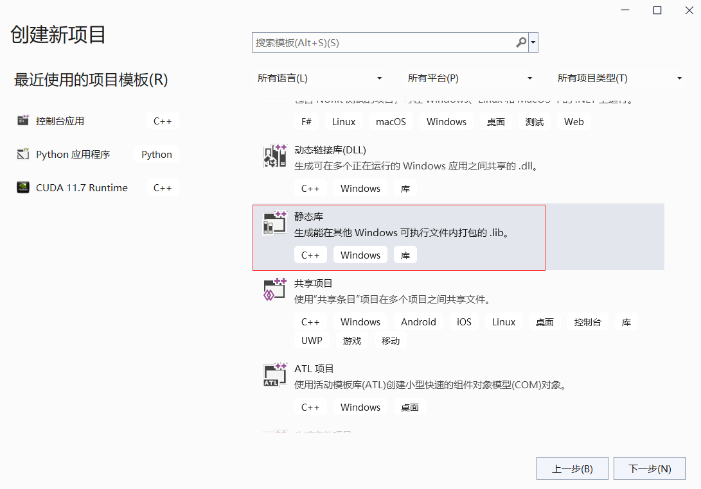

点击“下一步”按钮之后，配置该静态库项目，为它起个名儿，指定存放目录位置，如下图所示。

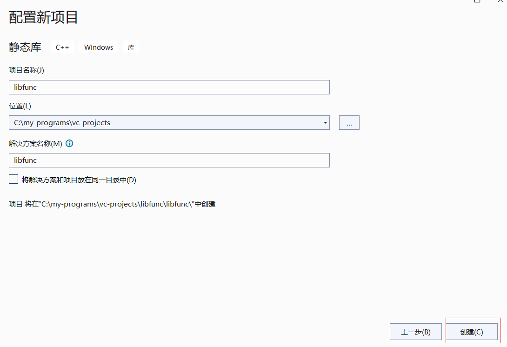

点击“创建”按钮之后，我们看右边“解决方案资源管理器”一栏，可以发现项目模板为我们生成了4个文件。我们全都选中之后（按住ctrl键可以多选），鼠标右键，点击“移除”按钮，如下图示。

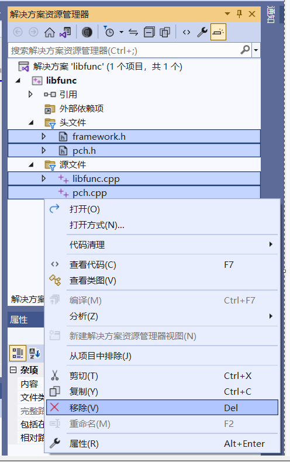

随后还会弹出提示框，我们选择“删除”，将它们完全删除掉。随后，我们可以把之前编辑完的 afunc.c 与 bfunc.c 源文件放在所创建项目的 **`libfunc/`** 目录下，该目录下还有 **libfunc.vcxproj** 文件，各位请留意一下，不要放错文件目录。

完成之后，我们回到Visual Studio，然后鼠标右键“源文件”，再点击“添加现有项”，将刚才存放的  afunc.c 与 bfunc.c 源文件加入到当前项目中，如下图所示。

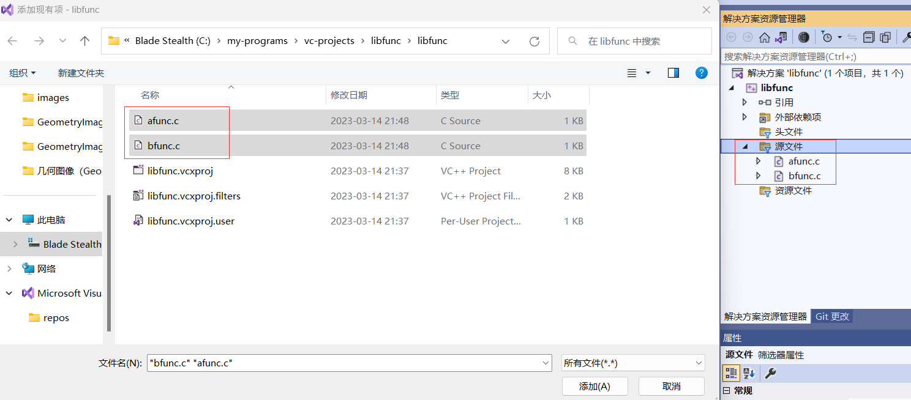

随后，我们再鼠标右键“解决方案资源管理器”下的 **libfunc** 项目，点击最下面的“属性”一项，如下图所示。


之后，我们对整个项目做比较完整的配置，如下图所示。

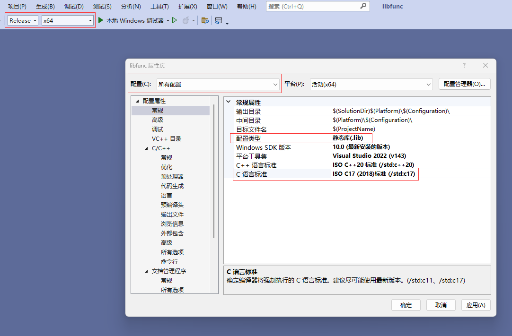

我们看上述截图，我们首先看左上角的两个红框框出来的部分，我们把当前项目设置为 **Release** 模式，并且采用 **x64** 执行环境。而中间我们先把“配置”选择为 **所有配置**。然后在下方“常规”项中将“配置类型”设置为 **静态库**；随后将“C语言标准”设置为n **ISO C17（2018）标准**。最后我们点击“确定按钮”。

我们这里其实还能留意到，在静态库项目中是没有“连接器”选项的，只有“文档管理程序”，而这里也不是让我们去配置连接选项的~🤭

我们随后展开“C/C++”一栏，然后点击“预编译头”，随后我们选择 **不使用预编译头**。如下图所示。

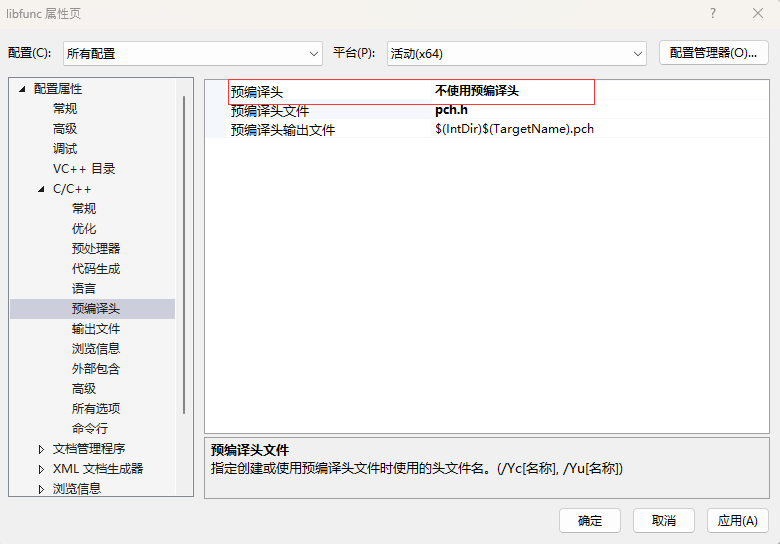

点击“确定”之后，我们就可以开始生成静态库了。方法很简单。鼠标右键点击“解决方案资源管理器”下方的 **libfunc** 项目，点击“重新生成”，Visual Studio 就会使用 MSVC 帮我们生成 **libfunc.lib** 文件了。如下图所示。

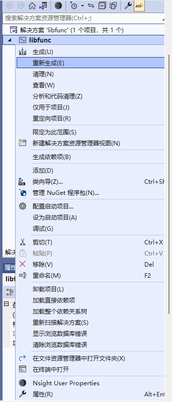

然后下方输出栏中的“生成”一栏会出现如下信息：

```shell
> 已启动重新生成...
1>------ 已启动全部重新生成: 项目: libfunc, 配置: Release x64 ------
1>afunc.c
1>bfunc.c
1>libfunc.vcxproj -> C:\my-programs\vc-projects\libfunc\x64\Release\libfunc.lib
========== “全部重新生成”: 1 成功，0 失败，0已跳过 ==========
========= 重新生成 开始于 10:17 PM，并花费了 00.894 秒 ==========
```

而生成的 **libfunc.lib** 文件会存放在当前项目根目录下的 **`x64/Release/libfunc.lib`** 中。

这时，我们就可以通过 Visual Studio 自带的 **`dumpbin.exe`** 工具来查看静态库中所包含的所有符号了。Windows系统的二进制目标文件遵循的是 [**PE**](https://learn.microsoft.com/en-us/windows/win32/debug/pe-format) 文件格式。

我们首先在开始菜单下找到 Visual Studio，然后点击“x64 Native Tools Command Prompt for VS 2022”，如下图所示。


然后我们在此控制台直接输入比如：

```bash
dumpbin /ALL C:\my-programs\vc-projects\libfunc\x64\Release\libfunc.lib
```

当然，这里的路径是需要填自己主机上所设置的静态库文件路径的。按下回车键之后，我们会看到很详细的关于此静态库的符号信息。这里其实列出了12个符号，如下所示：

```bash
   12 public symbols
   1 ??_C@_0BA@CEPACJML@This?5is?5DummyB?$CB@
   2 ??_C@_0BA@CGLGJHJC@This?5is?5DummyA?$CB@
   1 ??_C@_0CA@JMOFCLBC@This?5is?5InternalFunc?5for?5FuncB?$CB@
   2 ??_C@_0CA@JOKDJFEL@This?5is?5InternalFunc?5for?5FuncA?$CB@
   2 ??_C@_0P@FMKLONCL@This?5is?5FuncA?$CB@
   1 ??_C@_0P@FOONFDHC@This?5is?5FuncB?$CB@
   2 ?_OptionsStorage@?1??__local_stdio_printf_options@@9@9
   2 ?_OptionsStorage@?1??__local_stdio_scanf_options@@9@9
   2 FuncA
   1 FuncB
   2 FuncDummyA
   1 FuncDummyB
```

这里我们可以看到，afunc.c 与 bfunc.c 中各自的、具有内部连接的 **`InternalFunc`** 函数被完全剔除了。

<br/>

<a id="windows_link_static_library" name="windows_link_static_library"></a>
#### Windows系统下使用 Visual Studio 连接静态库

我们接下来利用 Visual Studio 创建一个C语言的控制台应用项目。我们同样先打开 Visual Studio，然后点击“创建新项目”，然后选择“C++控制台应用”，如下图所示。

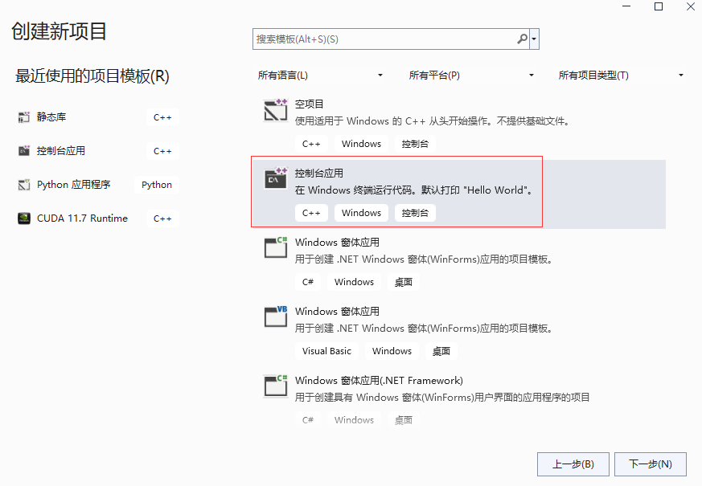

然后，我们为当前项目命名，这里使用 **main_test**，如下图所示。

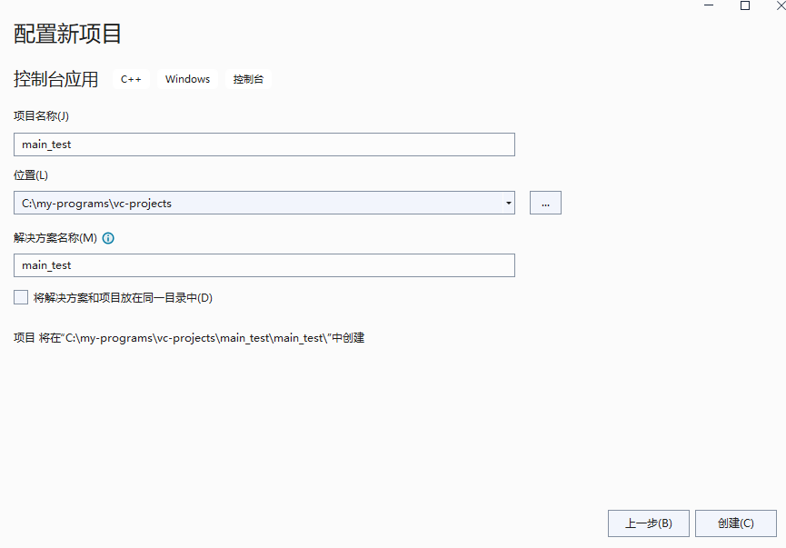

点击“创建”按钮之后，我们进入项目。跟创建静态库项目时一样，我们将项目模板里自动生成的 main_test.cpp 删除，然后将我们刚自己编辑好的 main_test.c 加入到当前项目中。随后，我们将刚才生成好的 **libfunc.lib** 也放到该目录，如下图所示。

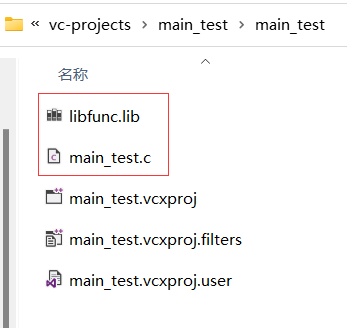

随后，我们将 main_test.c 添加到当前项目中。然后设置 **main_test** 项目属性，这里跟之前静态库项目一样配置编程语言选项，然后这里主要需要配置“链接器”选项，如下图所示。

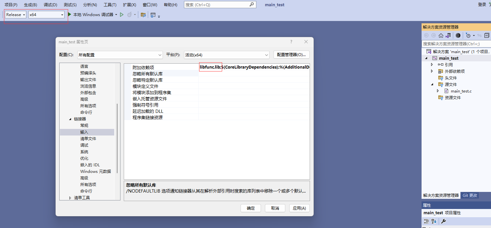
 
我们展开“链接器”，然后点击“输入”，再在“附加依赖项”中添加 **`libfunc.lib;`**。注意这里需要用分号（**;**）分隔符。点击“确认”按钮之后，我们点击工具栏中的绿色小三角就能编译运行整个程序了。运行之后会出现如下输出：

```shell
> This is FuncA!
This is InternalFunc for FuncA!
This is FuncB!
This is InternalFunc for FuncB!

C:\my-programs\vc-projects\main_test\x64\Release\main_test.exe (进程 85716)已退出，代码为 0。
要在调试停止时自动关闭控制台，请启用“工具”->“选项”->“调试”->“调试停止时自动关闭控制台”。
按任意键关闭此窗口. . .
```

下面，我们再使用 **`dumpbin.exe`** 来观察所生成可执行文件中的符号：

```bash
dumpbin /ALL C:\my-programs\vc-projects\main_test\x64\Release\main_test.exe
```

尽管这条命令会 dump 出非常多的信息，但我们自己搜一下 **FuncA**，则只能在字符串常量中找到该符号，相当于默认启用了移除所有符号的功能。我们这里只能找到关于 **`main`** 函数的符号信息：

```bash
Function Table (30)

              Begin       End        Info            Function Name

  00000000   00001000   0000103F   000027E8              main
  Unwind version: 1
  Unwind flags: None
  Size of prologue: 0x04
  Count of codes: 1
  Unwind codes:
  04: ALLOC_SMALL, size=0x28
```

<br/>

<a id="dynamic_library" name="dynamic_library"></a>
## 动态连接库

一个动态连接库是一个经过初步连接的、可被可执行程序或其他动态连接库在程序加载时被加载，亦可被执行程序在运行时加载的库。因此，一个动态连接库具有“连接”属性，可直接连接其他静态库或是引用其他动态连接库中的符号。

动态连接库在Windows系统上的文件后缀名为 **.dll**，意为：[**dynamic-link library**](https://learn.microsoft.com/en-us/cpp/build/dlls-in-visual-cpp)。而在类Unix系统上的文件后缀名为 **.so**，意为：[**shared object** library](https://opensource.com/article/20/6/linux-libraries)。

<br  />

<a id="linux_dynamic_library" name="linux_dynamic_library"></a>
#### Linux系统下创建并使用动态连接库

Linux系统下倘若我们使用 GCC 编译工具链来创建一个动态连接库，可使用 **`-shared`** **连接器选项** 进行生成。此外，对于较老的 GCC 编译器以及 GLIBC 库，Linux 系统还指定了动态连接库中的外部符号必须是 **位置独立的**（**Position-Independent**），因此如果我们要考虑系统兼容性，那么对于任何后续将要作为一个动态连接库进行连接的目标文件必须使用 **`-fPIC`** 这一 **编译选项** 进行指定。

下面，我们创建一个新的C源文件——**dfunc.c** 用于后续生成一个动态库，此外它还会调用之前已经创建好的 **libfunc.a** 静态库中的函数。我们先看以下代码：

```c
// dfunc.c
#include <stdio.h>

#ifdef _WIN32
#define CUSTOM_DLL_EXPORT   __declspec(dllexport)
#else
#define CUSTOM_DLL_EXPORT   __attribute__((visibility("default")))
#endif

extern void FuncA(void);
extern void FuncB(void);

static void InternalFunc(void)
{
    puts("This is InternalFunc for FuncD!");
}

void FuncD(void)
{
    puts("This is FuncD!");
    InternalFunc();

    FuncA();
    FuncB();
}

void FuncDummyD(void)
{
    puts("This is DummyD!");
}
```

该源文件定义了 **`CUSTOM_DLL_EXPORT`** 这个宏，但现在没用到。稍后会再做详细解释。我们看到这里又定义了两个全局函数——**`FuncD`** 及 **`FuncDummyD`**，稍后 **`FuncD`** 会被可执行程序调用到，而 **`FuncDummyD`** 则不会被引用到。

接下来，我们修改一下 **main_test.c** 这个源文件，添加对 **dfunc.c** 中所包含的 **`FuncD`** 函数的调用：

```c
// main_test.c

#include <stdio.h>

extern void FuncA(void);
extern void FuncB(void);
extern void FuncD(void);

int main(int argc, const char* argv[])
{
    FuncA();
    FuncB();
    FuncD();
}
```

我们看到，这个源文件仍然很简单，这里仅仅添加了对 函数 **`FuncD`** 的调用，此外之前的 **`FuncA`** 和 **`FuncB`** 仍然也会被调用，如果我们就连接 稍后要生成的 **libdfunc.so** 看看是否能顺利通过构建和运行呢？下面我们就先看一下新的编译脚本：

```shell
#! /bin/sh
# build_test.sh
gcc afunc.c  -o afunc.c.o  -c -std=gnu17
gcc bfunc.c  -o bfunc.c.o  -c -std=gnu17
gcc dfunc.c  -o dfunc.c.o  -c -std=gnu17
# Create a static library from afunc.c.o and bfunc.c.o
ar -crv libfunc.a  afunc.c.o bfunc.c.o
# Create a shared library from dfunc.c.o and libfunc.a
gcc dfunc.c.o  -o libdfunc.so -shared -L./ -lfunc
gcc main_test.c  -o main_test.c.o  -c -std=gnu17
gcc main_test.c.o  -o main_test -s -L./ -ldfunc
rm afunc.c.o bfunc.c.o dfunc.c.o main_test.c.o libfunc.a
```

上述编译脚本中我们可以发现没有对任何源文件使用 **`-fPIC`** 编译选项，由于在笔者当前所使用的 **Ubuntu 20.04** 结合 **GCC 9.4** 编译工具链下是可正常工作的。如果我们为了老平台的兼容性，则需要指定使用 **`-fPIC`** 这一编译选项，如下所示：

```bash
#! /bin/sh
# build_test.sh
gcc afunc.c  -o afunc.c.o  -c -std=gnu17 -fPIC
gcc bfunc.c  -o bfunc.c.o  -c -std=gnu17 -fPIC
gcc dfunc.c  -o dfunc.c.o  -c -std=gnu17 -fPIC
# Create a static library from afunc.c.o and bfunc.c.o
ar -crv libfunc.a  afunc.c.o bfunc.c.o
# Create a shared library from dfunc.c.o and libfunc.a
gcc dfunc.c.o  -o libdfunc.so -shared -L./ -lfunc
gcc main_test.c  -o main_test.c.o  -c -std=gnu17
gcc main_test.c.o  -o main_test -s -L./ -ldfunc
rm afunc.c.o bfunc.c.o dfunc.c.o main_test.c.o libfunc.a
```

我们看到，上述编译脚本中，对 **afunc.c**、**bfunc.c** 以及 **dfunc.c** 均使用了 **`-fPIC`** 编译选项。

上述代码第5行新增了对 **dfunc.c** 源文件的编译，这个跟其他源文件相比没有任何差异。而在第9行就是将 **dfunc.c.o** 同之前生成好的静态库 **libfunc.a** 进行连接，生成最终的动态连接库：**libdfunc.so**。我们可以发现，动态库的生成仍然可以直接使用gcc命令，并加以 **`-shared`** 连接器选项进行修饰指定。

而在第11行我们可以发现，此时最终可执行文件是单纯通过对 **libdfunc.so** 进行连接而生成，却不再依赖之前的静态库 **libfunc.a**。

由于我们之前提到，动态连接库是在可执行程序被加载时进行符号载入，因此我们在执行一个可执行程序之前需要把它所依赖的所有动态连接库的路径给指定好，加载器会通过自己指定的动态连接库的路径以及系统环境默认路径进行搜索当前可执行文件所依赖的动态连接库文件。因此方便起见，这里又做了一个运行脚本来快速启动我们现在生成好的 **main_test** 可执行程序：

```shell
#! /bin/sh
# run.sh
export LD_LIBRARY_PATH=./:${LD_LIBRARY_PATH}
./main_test
```

Linux系统下是通过 **`LD_LIBRARY_PATH`** 这一环境变量来指定动态连接库的搜索路径的。我们可在当前目录下直接执行 `sh run.sh` 即可执行程序，然后可得到以下输出：

```shell
> This is FuncA!
This is InternalFunc for FuncA!
This is FuncB!
This is InternalFunc for FuncB!
This is FuncD!
This is InternalFunc for FuncD!
This is FuncA!
This is InternalFunc for FuncA!
This is FuncB!
This is InternalFunc for FuncB!
```

我们能看到，该程序可顺利执行并得到我们所期待的结果。从而我们也能知道，原本 **libfunc.a** 静态库中的函数也确实被连入了 **libdfunc.so** 之中。

接下来，我们可以再次使用 **readelf** 工具来查看 **libdfunc.so** 中的符号情况。我们先输入以下命令：

```bash
readelf -s libdfunc.so
```

然后我们就看开始的动态符号一栏—— **Symbol table '.dynsym' contains 12 entries**。我们发现，原本 **libfunc.a** 中的外部全局函数，以及 **dfunc.c.o** 中的两个外部全局函数都包含在了 **libdfunc.so** 之中。

Num | Value | Size | Type | Bind | Vis | Ndx | Name
---- | ---- | ---- | ---- | ---- | ---- | ---- | ----
6: | 11c4 | 28 | FUNC | GLOBAL | DEFAULT | 14 | FuncA
7: | 1196 | 23 | FUNC | GLOBAL | DEFAULT | 14 | FuncDummyD
8: | 1170 | 38 | FUNC | GLOBAL | DEFAULT | 14 | FuncD
9: | 11e0 | 23 | FUNC | GLOBAL | DEFAULT | 14 | FuncDummyA
10: | 122a | 23 | FUNC | GLOBAL | DEFAULT | 14 | FuncDummyB
11: | 120e | 28 | FUNC | GLOBAL | DEFAULT | 14 | FuncB

此时我们会思考，由于 `FuncDummyA`、`FuncDummyB` 和 `FuncDummyD` 这三个函数没有被外部引用到，而且也不想暴露给外部其他动态连接库或可执行程序所调用，那我们是否能把它们从 **libdfunc.so** 中移除掉呢？我们先尝试对上述编译脚本中的第9行添加 **`-s`** 连接器选项，如下所示：

```bash
gcc dfunc.c.o  -o libdfunc.so -shared -s -L./ -lfunc
```

然后，我们编译之后的结果仍然与上面一样，所有的外部符号都在！为何动态连接库使用 **`-s`** 连接器选项之后行为与可执行文件不同呢？

因为在类Unix系统中，动态连接库在默认情况下，其中的外部符号，包括全局函数（**global function**）以及全局对象（**global object**）都是可被其他动态连接库或可执行文件访问的。这也是为何在类Unix系统中将动态连接库称为共享目标库（**shared object** library）的道理。因而我们在上述代码例子中可见，在可执行程序 **main_test** 中可直接访问 **libdfunc.so** 中的所有外部符号，包括它所连接的 **libfunc.a** 中的全局函数。

不过对于软件的模块化设计以及接口抽象原则设计而言，我们将所有外部符号暴露出去，一来肯定影响封装性，二来也对二进制目标的保密性和抽象性也受到很大影响！所以我们是否能把自己想要的符号暴露出去，而把其他全局函数或对象给默认隐藏呢？

类 Unix 系统搭配 GCC 和 LLVM-Clang 工具链提供了这种符号可见性机制，即 **visibility**。它是一个 **编译选项**，并含有四种值，分别是：**`default`**（默认），**`hidden`**（隐藏），**`internal`**（内部），以及 **`protected`**（受保护的）。下面我们分别来介绍一下这四种可见性模式：

1. **`default`**（默认）：默认可见性是 [**ELF**](http://flint.cs.yale.edu/cs422/doc/ELF_Format.pdf) 二进制目标文件格式的“正常”情况。如果某一外部符号使用了这种可见性属性，那么该符号可被其他动态库或可执行文件访问，并且也能覆盖同一符号的其他可见性属性。比如说，有一个 **liba.so** 动态连接库中定义了一个默认可见性的全局函数 **Foo**，而在 **libb.so** 动态连接库中定义了一个隐藏可见性或是受保护可见性的全局函数 **Foo**，那么当一个可执行程序既加载 **liba.so** 又加载 **libb.so** 时，**liba.so** 中的默认可见性的 **Foo** 将会覆盖掉 **libb.so** 中的 **Foo**。从而在可执行程序中调用的 **Foo** 将是 **liba.so** 中的实现。
1. **`hidden`**（隐藏）：隐藏可见性指示了该符号不会被放置到动态符号表中，从而其他模块（可执行程序或动态库）无法直接引用它。
1. **`internal`**（内部）：内部可见性类似于隐藏可见性，但它含有额外的处理器特定语义。除非我们指定了 **psABI** 编译选项，否则GCC定义了内部可见性使得当前函数永远不会被其他模块调用。要注意的是，尽管隐藏符号无法被其他模块所引用，但它们可以通过函数指针进行间接引用。通过指示一个符号无法从当前模块外部被调用，GCC比方说，可以忽略对一个PIC寄存器的加载，由于它已经知道该调用函数已经加载了正确的值。
1. **`protected`**（受保护的）：受保护的可见性指示了该符号将会被放在动态符号表（即 **Symbol table '.dynsym'**）中，但在定义该符号的模块内的引用将会绑定到局部符号。也就是说，该符号不能被其他模块所覆盖。

一般而言，我们常用的两个值为 **`default`** 和 **`hidden`**。在GNU语法扩展中，我们可以使用 **`__attribute__((visibility("vis")))`** 来指定当前全局函数或对象的可见性。这里的 ***vis*** 就是上述四个值的其中一种。

下面我们来做两件事，一件是对 **dfunc.c** 中的 **`FuncD`** 用 **`__attribute__((visibility("default")))`** 修饰，以指示它可被外部调用。第二件事，对其他源文件的编译使用 **`-fvisibility=hidden`** 这一 **编译选项**，使得所有没有显式用可见性属性修饰的全局对象与函数，全都默认使用“隐藏”可见性。

我们先对 **dfunc.c** 的第17行修改为：

```c
void CUSTOM_DLL_EXPORT FuncD(void)
```

随后，重新修改 **build_test.sh** 编译脚本文件，如下所示：

```bash
#! /bin/sh
# build_test.sh
gcc afunc.c  -o afunc.c.o  -c -std=gnu17 -fvisibility=hidden
gcc bfunc.c  -o bfunc.c.o  -c -std=gnu17 -fvisibility=hidden
gcc dfunc.c  -o dfunc.c.o  -c -std=gnu17 -fvisibility=hidden
# Create a static library from afunc.c.o and bfunc.c.o
ar -crv libfunc.a  afunc.c.o bfunc.c.o
# Create a shared library from dfunc.c.o and libfunc.a
gcc dfunc.c.o  -o libdfunc.so -shared -s -L./ -lfunc
gcc main_test.c  -o main_test.c.o  -c -std=gnu17
gcc main_test.c.o  -o main_test -s -L./ -ldfunc -lfunc
rm afunc.c.o bfunc.c.o dfunc.c.o main_test.c.o libfunc.a
```

我们看到这里主要做两四处修改。前三处是3、4、5行，在后面均新增了 **`-fvisibility=hidden`** 编译选项。而第四处则是第11行，再次新增了 **`-lfunc`**，对 **libfunc.a** 静态库的连接。由于 **libdfunc.so** 中关于 **libfunc.a** 静态库的外部符号都被 **隐藏** 了，因此外部模块无法再被使用。因而可执行程序模块 **main_test** 必须再度显式连接 **libfunc.a** 静态库。

由此我们也能认识到，“可见性”属性只针对动态连接库以及可执行程序这些具有连接属性的模块起作用，而静态库中的外部符号的可见性是在被连接到具有连接属性的模块之后才起作用的。所以，这里 **libdfunc.so** 中的 **`FuncA`**、**`funcB`** 等函数均对外隐藏了。 我们执行完 `sh build_test.sh` 命令之后，再次使用 `readelf -s libdfunc.so` 命令来查看此时的 **libdfunc.so** 中的符号情况。

我们发现，这里在 **Symbol table '.dynsym' contains 7 entries** 下方仅列出了 **FuncD** 这一个符号。然而，倘若我们在编译脚本的第9行将 **-s** 连接器选项移除掉，变成：`gcc dfunc.c.o  -o libdfunc.so -shared -L./ -lfunc`，那么在 **libdfunc.so** 中，尽管 **Symbol table '.dynsym'** 仅含有  **FuncD** 这一个符号，但下面的 **Symbol table '.symtab'** 中仍然存在 **`FuncA`**、**`FuncB`** 等外部符号。不过这也不影响 **main_test** 可执行程序的构建与运行。

<br/>

<a id="windows_dynamic_library" name="windows_dynamic_library"></a>
#### Windows系统下创建并使用动态连接库

接着，我们将给各位介绍如何在 Windows 系统下使用 Visual Studio IDE 来创建一个动态连接库项目工程，并最终连接到可执行程序中。

我们首先打开 Visual Studio，然后点击“创建新项目”，在项目模板中选择“动态链接库(DLL)”，如下图所示。

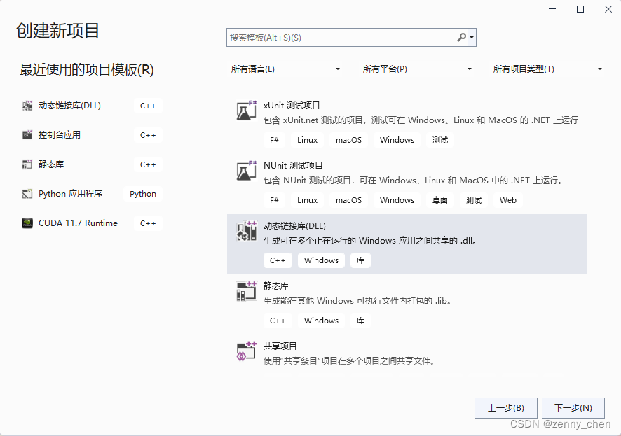

点击“下一步”，然后为当前项目命名，这里笔者仍然起与 Linux 系统上一样的名 “libdfunc”。完了之后，点击“创建”按钮。

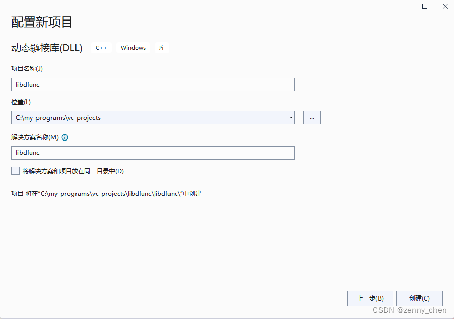

进入项目之后，我们先把没必要的文件全都删除。如下图红框框出来的部分。

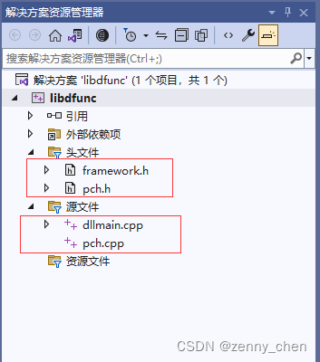

随后将我们之前编辑好的 **dfunc.c** 以及之前生成好的 **libfunc.lib** 放到当前项目目录中，然后再将 **dfunc.c** 源文件添加到当前项目工程中。

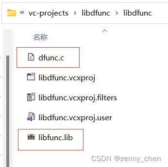

之后，我们同样编辑 **libdfunc** 项目属性，将一些值改为如下图红框框出来所示的样子。

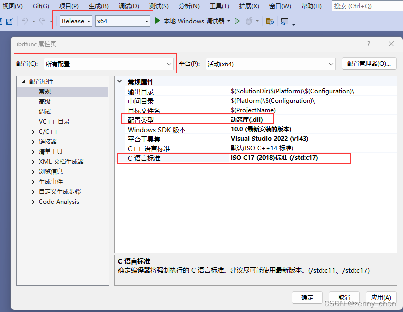

随后，我们同样将“预编译头”去除，如下图所示。

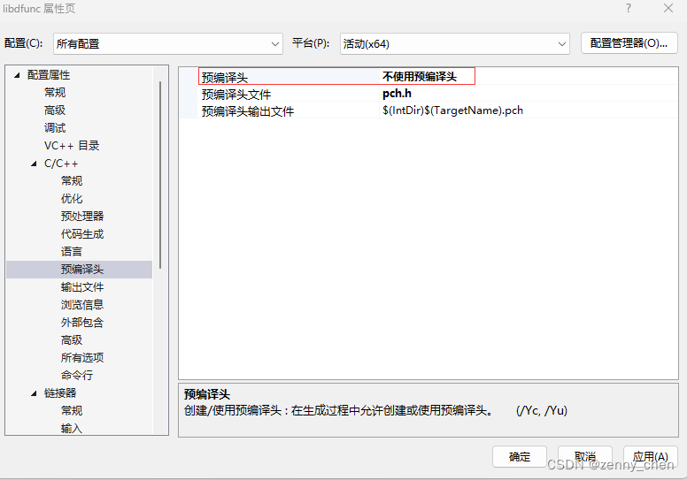

最后，我们设置“链接器”选项，在其“输入”一栏中的“附加依赖项”中添加：**`libfunc.lib;`**，添加对静态库 **libfunc.lib** 的连接。这里需要注意的是，Windows系统下的分隔符一般使用分号 **`;`**。

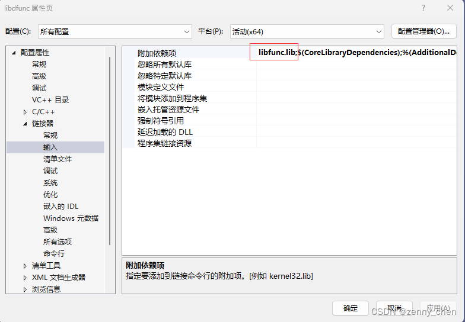

我们经过上述步骤的设置之后就可以点击工具栏上的绿色三角箭头按钮，构建生成 **libdfunc.dll** 了。

接下来，我们可以同上面观察静态库的符号那些操作一样，通过在开始菜单下找到Visual Studio，然后点击“x64 Native Tools Command Prompt for VS 2022”，进入命令行。这次我们先用 **`cd`** 命令进入到当前项目的根目录，然后输入以下命令：

```bash
dumpbin /ALL x64/Release/libdfunc.dll
```

我们可以发现，当前 **libdfunc.dll** 中只有 **`FuncD`** 这一个外部符号输出：

```shell
> Function Table (37)

           Begin    End      Info      Function Name

  00000000 00001000 00001057 00002740  FuncD
    Unwind version: 1
    Unwind flags: None
    Size of prologue: 0x04
    Count of codes: 1
    Unwind codes:
    04: ALLOC_SMALL, size=0x28
```

最后，我们进入 **`x64/Release/`** 目录，将里面生成好的 **libfunc.lib** 与 **libdfunc.dll** 复制出来：

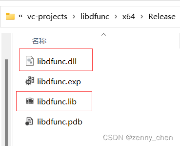

然后黏贴到我们之前创建好的 **main_test** 项目目录中。我们现在打开  **main_test** 项目的解决方案文件——**main_test.sln**。进入后再度编辑其项目属性，选择“链接器”选项的“输入”一栏，在“附加依赖项”中添加 **libdfunc.lib**。

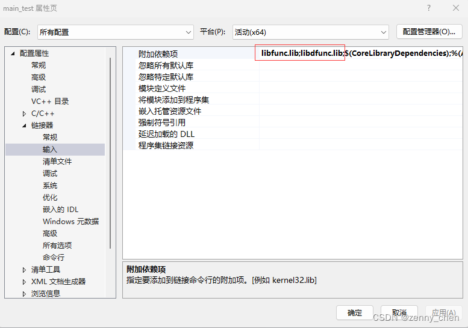

随后，我们再重新编辑一下 **main_test.c**，如下所示：

```c
#include <stdio.h>

extern void FuncA(void);
extern void FuncB(void);
extern void __declspec(dllimport) FuncD(void);

int main(int argc, const char* argv[])
{
    FuncA();
    FuncB();
    FuncD();
}
```

上述代码中我们看到，在 Windows 系统下使用 MSVC 编译器的时候，使用 **`__declspec(dllimport)`** 这一属性来指示，当前外部函数或对象是通过动态连接库（dll）导入进来的。

最后，我们直接点击工具栏中的三角按钮即可编译运行 **main_test.exe** 程序了。这里不会有任何编译问题，也没有运行时问题。我们可以得到以下输出：

```shell
> This is FuncA!
This is InternalFunc for FuncA!
This is FuncB!
This is InternalFunc for FuncB!
This is FuncD!
This is InternalFunc for FuncD!
This is FuncA!
This is InternalFunc for FuncA!
This is FuncB!
This is InternalFunc for FuncB!
```

因为 Windows 系统会将当前路径默认作为动态连接库的搜索路径，因此当我们可执行文件与dll文件放在同一目录下时，我们能成功运行该可执行程序。但如果我们的可执行文件与dll文件放在不同路径，那么我们要么通过设置系统中的环境变量 **`PATH`** 进行指定，要么跟Linux系统一样，通过在执行可执行程序之前设置一下 **`PATH`** 环境变量以顺利运行。

在Visual Studio IDE中，我们可以通过设置“调试”配置属性中的“环境”项来指定动态连接库的搜索路径，如下图所示：

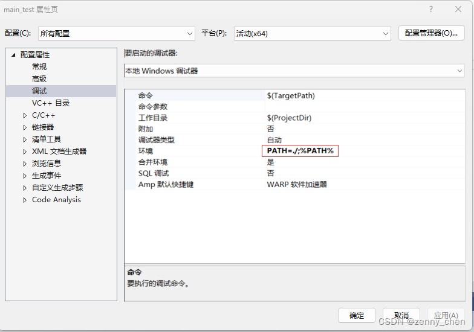

这里相当于使用了这个命令：

```bash
set PATH=./;%PATH%
```

这里再次提醒，Windows 系统下使用分号 **`;`** 作为列表分隔符；而类Unix系统下一般使用冒号 **`:`**。所以我们也可以将 **`PATH`** 的设置写在一个 **bat** 文件中，然后紧接着执行指定的可执行文件，就跟类 Unix 系统中的 shell 脚本类似。

<br/>

<a id="dll_runtime" name="dll_runtime"></a>
## 运行时动态加载动态连接库中的符号

我们之前已经提到过，动态连接库除了可以在程序被操作系统加载时做符号加载之外，我们还能在程序运行时，通过系统API进行选择性地动态加载自己所需要的符号。下面我们将分别通过 Linux 系统与 Windows 系统环境来为各位描述如何在可执行程序中动态加载动态连接库中的符号。

<br/>

<a id="dll_runtime_linux" name="dll_runtime_linux"></a>
#### Linux系统中运行时动态加载动态连接库中的符号

在类Unix系统环境下，我们通过 [**dlopen**](https://linux.die.net/man/3/dlopen) 系API做动态连接库的运行时加载。我们在使用该API时需要引入头文件：**`<dlfcn.h>`**，然后在程序连接时需要连接 **libdl.so**，因而需要使用 **`-ldl`** 连接选项。

该库具有四个接口，分别是： 

- `void *dlopen(const char *filename, int flag);`：用于打开指定的动态连接库文件。第二个参数往往使用 **`RTLD_LAZY`** 即可。
- `void *dlsym(void *handle, const char *symbol);`：加载指定动态连接库中的指定符号。
- `int dlclose(void *handle);`：关闭指定的动态库句柄。如果当前对同一动态库的所有句柄被关闭，那么它就会卸载所有该动态库中的符号，最后再关闭该动态库文件。
- `char *dlerror(void);`：用于查询当前动态加载库的过程中所产生的错误信息。

下面我们通过修改 **main_test.c** 中的相关内容来为大家展示这些接口的使用方式。

```c
// main_test.c

#include <stdio.h>
#include <dlfcn.h>

extern void FuncA(void);
extern void FuncB(void);

int main(int argc, const char* argv[])
{
    FuncA();
    FuncB();
    
    void *soHandle = dlopen("libdfunc.so", RTLD_LAZY);
    if(soHandle == NULL)
    {
        puts("libdfunc.so not found!");
        return -1;
    }

    void (*pFuncD)(void) = dlsym(soHandle, "FuncD");
    if(pFuncD == NULL)
    {
        puts("Symbol FuncD not Found!");
        dlclose(soHandle);
        return -1;
    }

    // Call FuncD()
    pFuncD();

    dlclose(soHandle);
}
```

完成之后，我们再修改一下 **build_test.sh** 脚本文件中的第11行，移除对 **libdfunc.so** 的连接，并在最后添加 **`-ldl`** 连接选项：`gcc main_test.c.o  -o main_test -s -L./ -lfunc -ldl`。

最后，我们就可以通过执行运行脚本：`sh run.sh` 来执行该程序了。

<br/>

<a id="dll_runtime_windows" name="dll_runtime_windows"></a>
#### Windows系统中运行时动态加载动态连接库中的符号

Windows系统中，我们通过直接引入 **`<Windows.h>`** 头文件即可访问动态库加载API。而真正的用于动态连接库加载的API是声明在了 [**libloaderapi.h**](https://learn.microsoft.com/en-us/windows/win32/api/libloaderapi/) 之中。在Windows系统中，一般常用的动态加载库的接口有：

- [`HMODULE LoadLibraryA( [in] LPCSTR lpLibFileName);`](https://learn.microsoft.com/en-us/windows/win32/api/libloaderapi/nf-libloaderapi-loadlibrarya)：用于加载一个指定路径的动态连接库，并返回对应的句柄。
- [`FARPROC GetProcAddress([in] HMODULE hModule, [in] LPCSTR  lpProcName);`](https://learn.microsoft.com/en-us/windows/win32/api/libloaderapi/nf-libloaderapi-getprocaddress)：用于获得指定动态连接库中的指定符号。
- [`BOOL FreeLibrary([in] HMODULE hLibModule);`](https://learn.microsoft.com/en-us/windows/win32/api/libloaderapi/nf-libloaderapi-freelibrary)：释放指定的动态连接库句柄。

下面我们就改写一下 **main_test.c** 来为大家展示一下这些API的用法：
```c
#include <stdio.h>
#include <Windows.h>

extern void FuncA(void);
extern void FuncB(void);

int main(int argc, const char* argv[])
{
    FuncA();
    FuncB();

    HMODULE dllModule = LoadLibraryA("libdfunc.dll");
    if (dllModule == NULL)
    {
        puts("libdfunc.dll not found!");
        return -1;
    }

    FARPROC pFunc = GetProcAddress(dllModule, "FuncD");
    if (pFunc == NULL)
    {
        puts("FuncD cannot be located!");
        return -1;
    }

    // Call FuncD()
    void (*pFuncD)(void) = (void(*)(void))pFunc;
    pFuncD();

    const BOOL result = FreeLibrary(dllModule);
    if (!result) {
        puts("FreeLibrary failed!");
    }
}
```
完成之后，我们直接点击工具栏上的绿色三角箭头按钮即可完成程序构建并直接运行。由于Windows系统上的动态加载库直接就已经定义在了 **kernel.dll** 以及 **kernel.lib** 之中，而这系统库文件是被MSVC编译工具链自动连接的，因此无需我们手工再去指定。当然，我们可以把之前连接的 **libdfunc.lib** 的连接给去掉，尽管不去也没问题。


